# SCADA Blockchain Provenance & Data Network Fabric 

Use-Case: Stream SCADA ICS Flows with Blockchain Provenance to Data Center in Texas

Stacks:
- Golang
- Rust
- Nats.io
- 

Architecture
- ICS Network Port 4443 -> Mothership Data Lake -> Multi-Tenant Client Interface

```mermaid

flowchart TD
    subgraph scada-client-node
        meta[Collect Client Metadata]
        
        subgraph Stream ICS Motherboard Data
            source[Source .csv File]
            read[Read SCADA data]
            source --> read
        end
    end
    subgraph oil-domain-ai
        gitr-document-ai
    end
    subgraph mbl-backend
        nats[TCU SCADA Mothership]
        read -->|Push Data - nats://4222| nats

        nats --> C{Consume SCADA data}
        C -->|Invoicing| D[Generate USD or BTC Invoice]
        C -->|XYZ Back Office Workflow| E[Misc. Business Process Improvement]
        
        D --> H[fa:fa-bank Bank or BTC Address]
    end
    oil-domain-ai-->gitrds
    subgraph data-core-infrastructure
        
        OCI[(MBL S3 Bucket)]
        read -->|Archival, Retention, Compliance| OCI
        C -->|Write to Database| mbldw
        mbldw[(MBL_DW)]
        gitrds[(GITR Data Store)]
    end
        meta --> source


    style nats fill:#340034,stroke:#333,stroke-width:2px
    style source fill:#acf,stroke:#333,stroke-width:2px
    style read fill:#dfa,stroke:#333,stroke-width:2px
    style data-core-infrastructure fill:#
```

Team:
- Tobalo Torres-Valderas
- Dr. Ed Ipser
- John Kohn
- Ian Valderas
- Abel Bustamante
- Kelly Slaughter

Sponsors:
- TCU - CS Dept & Neeley
- Oracle
- Yeetum
- FWTX DAO
- Texas Blockchain Council
